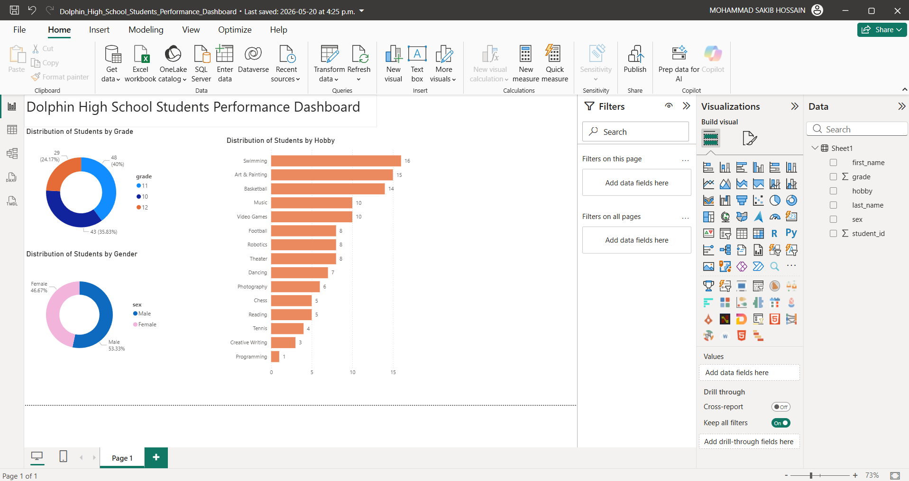

# 🐬 Dolphin High School Student Performance Dashboard

> An interactive Power BI dashboard analysing student demographics, grade distribution, gender breakdown, and hobby preferences across a fictional high school.


[← Back to Portfolio](../README.md)

---

## 📊 Dashboard preview



---

## 📌 Project summary

This interactive dashboard visualises student data for **Dolphin High School** — a fictional secondary school. The dataset covers 120+ students across grades 10, 11, and 12, with information on gender and extracurricular hobbies. Interactive slicers allow filtering by grade and gender to explore student distribution patterns.

**Dataset covers:**
- 120+ students across grades 10, 11, and 12
- Gender breakdown: Male and Female
- 15+ hobbies including Football, Swimming, Art & Painting, Robotics, Programming, Music, and more
- Student distribution across grades

---

## 🔍 Key insights

- **Grade 10 has the largest student cohort** — with the most entries in the dataset, suggesting a larger intake year.
- **Swimming and Art & Painting are the most popular hobbies** — appearing frequently across all three grades and both genders.
- **Male students outnumber female students** — particularly in grade 10, where the gender gap is most visible.
- **STEM-related hobbies (Robotics, Programming, Chess) are male-dominated** — while Creative Writing, Dancing, and Theater skew female.

---

## 🛠️ Tools used

| Tool | Purpose |
|---|---|
| Power BI Desktop | Interactive report building with slicers and filters |
| DAX | Student count measures, gender and grade breakdowns |
| Microsoft Excel | Source data (Students with grade, gender, hobby) |
| Power Query | Data transformation and categorical grouping |

---

## 📁 Files

```
dolphin-high-school-performance/
│
├── data/
│   └── dolphin_high_school_students.xlsx                     ← Student data
├── screenshots/
│   └── dolphin-high-school-dashboard.png                     ← Dashboard preview
├── Dolphin_High_School_Students_Performance_Dashboard.pbix   ← Power BI report
└── README.md
```

---

## ▶️ How to view

1. Download `Dolphin_High_School_Students_Performance_Dashboard.pbix`
2. Open it in [Power BI Desktop](https://powerbi.microsoft.com/desktop/) (free)
3. Use the slicers to filter by grade or gender to explore the data interactively
