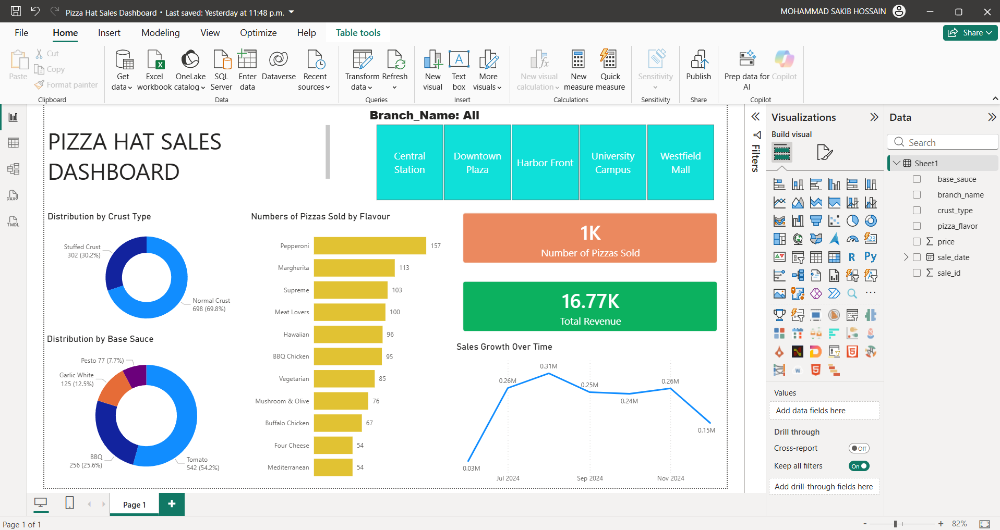

# 🍕 Pizza Hat Sales Dashboard

> An interactive Power BI dashboard analysing pizza sales across 5 branches, tracking flavours, crust types, base sauces, and revenue performance.


[← Back to Portfolio](../README.md)

---

## 📊 Dashboard preview



---

## 📌 Project summary

This interactive dashboard tracks sales performance for **Pizza Hat** — a fictional pizza chain with 5 branches. The dataset covers sales from June to July 2024, with each order capturing branch, pizza flavour, crust type, base sauce, and price. Interactive slicers allow filtering by branch, flavour, and crust type.

**Dataset covers:**
- 5 branches: Central Station, Downtown Plaza, Harbor Front, University Campus, Westfield Mall
- 10 pizza flavours including Pepperoni, Margherita, Meat Lovers, Mediterranean, and more
- 2 crust types: Normal Crust, Stuffed Crust
- 4 base sauces: BBQ, Tomato, Garlic White, Pesto
- Price range: $12.39 – $21.11 per pizza

---

## 🔍 Key insights

- **Stuffed Crust pizzas command a higher price** — averaging $2–$4 more per pizza than Normal Crust equivalents of the same flavour.
- **Mediterranean and Meat Lovers are the highest-priced flavours** — both exceeding $18 on Stuffed Crust, making them the top revenue drivers per unit.
- **Pepperoni is the most frequently ordered flavour** — appearing consistently across all 5 branches throughout the period.
- **Central Station and Downtown Plaza show the highest order frequency** — suggesting they are the busiest branches in the chain.

---

## 🛠️ Tools used

| Tool | Purpose |
|---|---|
| Power BI Desktop | Interactive report building with slicers and filters |
| DAX | Revenue calculations, branch-level aggregations |
| Microsoft Excel | Source data (Sales with branch, flavour, crust, price) |
| Power Query | Data transformation and date/time formatting |

---

## 📁 Files

```
pizza-hat-sales/
│
├── Pizza_Hat_Sales_Dashboard.pbix     ← Power BI report
├── data/
│   └── pizza_hat_pizza_sales.xlsx     ← Sales data
├── screenshots/
│   └── pizza-hat-dashboard.png        ← Dashboard preview
└── README.md
```

---

## ▶️ How to view

1. Download `Pizza_Hat_Sales_Dashboard.pbix`
2. Open it in [Power BI Desktop](https://powerbi.microsoft.com/desktop/) (free)
3. Use the slicers to filter by branch, flavour, or crust type interactively
