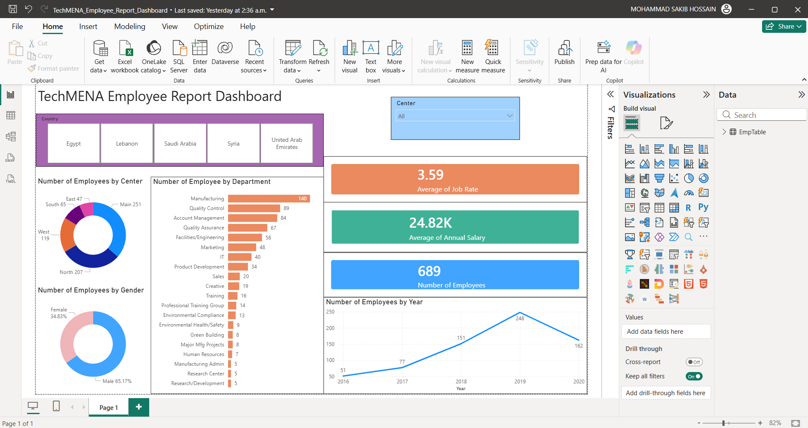

# 💼 TechMENA Employee Report Dashboard

> An interactive Power BI HR dashboard analysing employee data across departments, countries, salary bands, and leave patterns for a fictional MENA-region tech company.


[← Back to Portfolio](../README.md)

---

## 📊 Dashboard preview



---

## 📌 Project summary

This interactive HR dashboard analyses workforce data for **TechMENA** — a fictional technology company operating across the MENA region. The dataset covers 57+ employees across multiple departments, countries, and work centres, including salary, overtime, and leave data. Interactive slicers allow filtering by country, department, gender, and centre.

**Dataset covers:**
- 57+ employees across Egypt, Saudi Arabia, United Arab Emirates, and Syria
- 4 work centres: Main, North, South, West
- 15+ departments including Manufacturing, Quality Control, Sales, IT, Marketing, and more
- Monthly and annual salary data
- Sick leave, unpaid leave, and overtime hours per employee
- Job rate scores (1–5)

---

## 🔍 Key insights

- **Egypt has the largest employee headcount** — making it the dominant country in the workforce across almost all departments.
- **Quality Control is the most staffed department** — with employees spread across all four work centres and multiple countries.
- **Salary ranges vary significantly** — from $808/month to $3,404/month, indicating a wide gap between junior and senior roles.
- **Overtime is concentrated in a small number of employees** — a few individuals log 100–198 overtime hours while the majority log under 15, suggesting uneven workload distribution.

---

## 🛠️ Tools used

| Tool | Purpose |
|---|---|
| Power BI Desktop | Interactive HR report with slicers and drill-throughs |
| DAX | Salary aggregations, leave totals, overtime measures |
| Microsoft Excel | Source data (Employees with department, salary, leave, overtime) |
| Power Query | Data transformation and date formatting |

---

## 📁 Files

```
techmena-employee-report/
│
├── data/
│   └── techmena_Employees.xlsx               ← Employee data
├── screenshots/
│   └── techmena-dashboard.png                ← Dashboard preview
├── TechMENA_Employee_Report_Dashboard.pbix   ← Power BI report
└── README.md
```

---

## ▶️ How to view

1. Download `TechMENA_Employee_Report_Dashboard.pbix`
2. Open it in [Power BI Desktop](https://powerbi.microsoft.com/desktop/) (free)
3. Use the slicers to filter by country, department, gender, or work centre interactively
